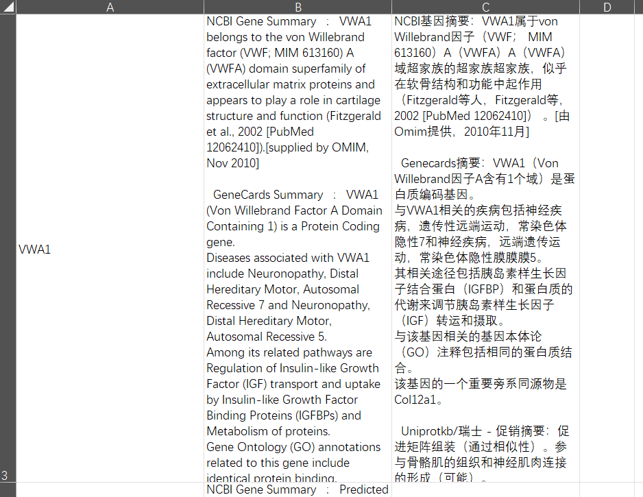

# 自动从genecards爬出相关基因的相关信息，并且进行一个翻译

## 介绍

帮助中国医学生从genecards找到相关基因的相关信息，并进行一个简单的翻译操作。

如果你并不太关心代码，只是想使用里面的功能，你可以看这个[使用说明](https://www.cnblogs.com/acidbarium/p/18731876).


## 项目修改说明

这个项目是基于 [marswh12312313的爬虫项目](https://github.com/marswh12312313/GeneSumCrawler/tree/main) 修改而来的，原项目的版权属于 Maria (2023)，并使用 MIT 许可证。

我对原项目做了以下修改：
- 新增了中文翻译功能
- 修改了代码实现中表格设计的方式
- 更改了不同系统所需要的geckodriver文件

此项目同样遵循 MIT 许可证，详细信息请参考 `LICENSE` 文件。


## 项目文件说明

- geneCardsWebScraper是主程序，包含了爬虫和翻译，直接运行即可。
- geckodriver.exe是项目的火狐浏览器驱动，来自于[GeckoDriver Releases](https://github.com/mozilla/geckodriver/releases),原仓库中为linux下的文件，考虑到中国大多数医学生使用的是windows操作系统，这里进行了一个更替。如果你使用的是mac或者linux，你仍然可以在[GeckoDriver Releases](https://github.com/mozilla/geckodriver/releases)选择适合你的版本。
- msedgedriver.exe是项目的edge浏览器驱动，来自[微软官方网站](https://developer.microsoft.com/en-us/microsoft-edge/tools/webdriver/?form=MA13LH)
- trans和trans_deepl是单独摘出来的翻译代码
- genelist.csv中放你需要查询的基因的名字
- gene_summaries.csv爬取到的信息（在程序运行完之后显示）
- gene_summaries_afterTrans.csv为翻译后的信息（在程序运行完之后显示）
- EdgeVersion文件夹 和FireFoxVersion文件夹 分别为两个不同驱动下的代码，在本项目根目录下的代码包含了以上两者的功能。
- deepseek文件夹为使用deepseek进行翻译的代码集合，考虑到受众较小，目前暂不提供与主代码合并的服务。如果有使用更高级的翻译需求，可以在该文件夹中看到相应的操作说明。


## 安装依赖项
```
pip install selenium deep-translator beautifulsoup4 pandas
```

## 项目驱动
- 里面包含了一个windows的项目驱动文件，详情见上文项目文件说明的geckodriver.exe和msedgedriver.exe。

- 确保 GeckoDriver 已正确安装并位于系统的 PATH 中，或使用 GeckoDriver或者msedgedriver可执行文件的正确路径更新脚本

- 你可能还需要一个最新版的火狐浏览器或者edge浏览器(感谢[kpmark](https://github.com/markzhang12345)，他写了一个edge浏览器的版本)


## 运行脚本

```python
python geneCardsWebScraper.py
```

## 运行效果



## 鸣谢

[marswh12312313](https://github.com/marswh12312313)，[kpmark](https://github.com/markzhang12345)


## 贡献者名单
<a href="https://github.com/AcidBarium/GeneCardsWebScraper/graphs/contributors">
  
</a>


## 联系方式

acidbarium@163.om